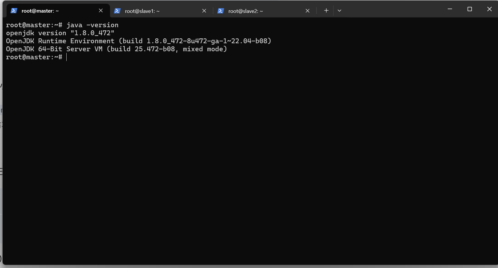
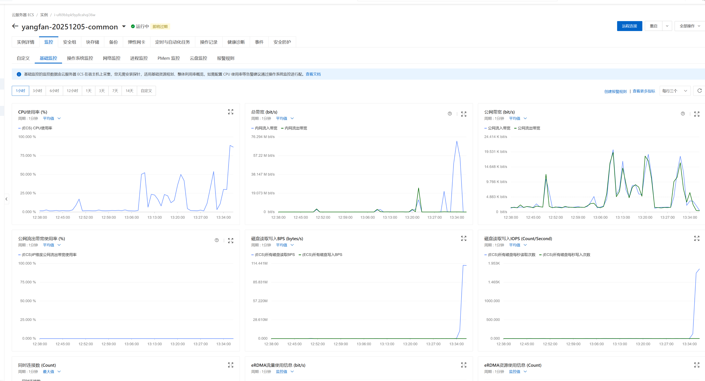
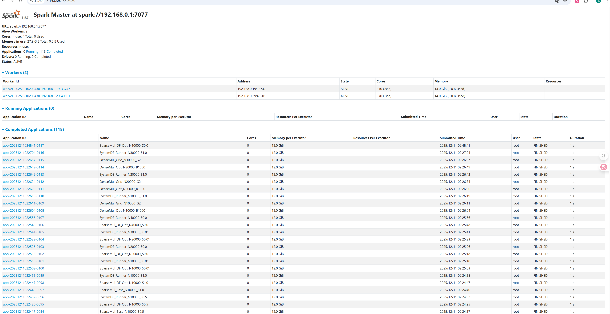

## 小组信息
选题：
**I 基于Spark的分布式矩阵乘法实现与优化**

小组成员：
杨帆（组长） 张仕浩 刘飞扬 盛子骜

## 研究目的
基于Spark实现分布式矩阵乘法，并与SystemDS中的实现进行比较。

## 研究内容
基于Spark实现分布式矩阵乘法，并在实现过程中尽可能引入多种优化策略，以提升计算效率。对比分析当前实现与SystemDS中若干实现的差异，探讨它们各自的优缺点和适用场景。

## 实验

### 实验环境
#### 硬件：
> 节点数：3个(1 master + 2 worker)
>
> 节点配置：
> - master: 2核8g，40G系统盘，带宽100Mbps；
> - worker: 2核16g，40G系统盘 + 额外100G SSD，带宽100Mbps。

#### 软件：
> 镜像：Ubuntu 22.04
>
> 语言版本：JAVA 11、Python 3.10
>
> 框架版本：Apache Hadoop 3.3.6、Apache Spark 3.5.7、Apache SystemDS 3.3.0
> 
> Python依赖库：均采用最新版本

### 实验负载
1. 计算任务：
   大规模分布式矩阵乘法
2. 数据集：
   程序运行时动态生成的合成数据集，包含以下两种类型：
   - 密集矩阵（Dense Matrix）:
     - 规模：N x N, 默认N = 10000；
     - 数据分布：[0,1)之间均匀分布的随机浮点数；
     - 存储：分块存储 (Block Matrix)，默认块大小 1000 x 1000。
   - 稀疏矩阵（Sparse Matrix）:
     - 规模：N x N, 默认N = 10000 或 20000;
     - 稀疏度：0.01；
     - 存储：CSR (Compressed Sparse Row) 或 COO 格式进行压缩存储。
3. 对比组：
   - Spark Baseline：
        基于 Shuffle Join 的朴素实现
   - Spark Optimized：
     - 密集：基于 2D-Grid 分区策略和 Broadcast 策略；
     - 稀疏：基于 SciPy CSR 的本地向量化计算优化。
   - SystemDS：
        作为性能对照组 (Baseline/Upper Bound)，测试其自动优化下的执行效率。

### 实验步骤
#### 1.配置云服务器和运行环境

服务器部署：

配置hosts及ssh连接：

安装环境等：

最终成功运行：

#### 2.编写实验代码
详见`code`目录。

#### 3.执行实验脚本、记录并分析数据
运行自动化测试脚本`run_full_experimen.sh`，会自动提交所有子任务（各任务见“实验负载”部分）并进行性能监控。

部分运行时状态截图：

完整log详见`code`目录。

### 实验结果与分析

**实验环境配置：**
* **总核心数：** 2 (Executors) x 2 (Cores/Executor) = 4 Cores
* **Executor 内存：** 12 GB
* **Driver 内存：** 4 GB
* **并行度：** spark.default.parallelism=24

**初始配置测试分析 (N=10000, 密集矩阵 2D-Grid)**

| 运行次数 | Wall Clock (s) | CPU Util (%) | Tasks | Python Time (s) | Total GC (s) | Shuffle Read (GB) | Shuffle Write (GB) |
| :--- | :--- | :--- | :--- | :--- | :--- | :--- | :--- |
| **平均值** | 42.74 | ≈ 70.2 | 24 | ≈ 120.0 | 1.19 | 2.98 | 2.98 |

**分析要点：** Python Time 远超 Wall Clock，表明所有核心在并行进行 Python 向量计算。Wall Clock 时间稳定，验证了该配置和算法的**运行稳定性**。

---

#### 1/5: 密集矩阵核心对比实验 (N=10000)

矩阵乘法 $C = A \times B$ 的核心在于计算 $C_{ij} = \sum_k A_{ik} \times B_{kj}$。

| Implementation | 核心原理 | Shuffle 策略 | Wall Clock (s) | CPU Util (%) | Tasks | Python Time (s) | Total GC (s) | Shuffle Read (GB) | Shuffle Write (GB) |
| :--- | :--- | :--- | :--- | :--- | :--- | :--- | :--- | :--- | :--- |
| **SystemDS (Dense)** | **运行时优化 + In-Memory**。内存足够时，利用底层高性能库在内存中计算。 | **零 Shuffle**。 | **6.58** | 0.00 | 0 | 0.00 | 0.00 | 0.00 | 0.00 |
| **Spark Dense Opt (2D-Grid) (Avg)** | **二维网格分块** + 本地向量化。  | **最小化 Shuffle**。按 Key (i, j) 分发 A_ik 和 B_kj 块。 | 42.66 | 73.08 | **28** | **71.05** | 1.48 | 5.96 | 2.98 |
| **Spark Dense Opt (Broadcast)** | **广播优化**。将一个矩阵完整复制到所有 Executor 内存。 | **避免 Shuffle Join**。但增加了内存开销。 | 109.60 | 77.29 | 80 | 67.20 | **3.71** | 3.59 | 2.16 |
| **Spark Dense Baseline (Shuffle Join)** | **传统 MapReduce Join**。将矩阵元素展开为三元组，通过 Key k 进行连接。 | **高 Shuffle**。需要两次完整的 Shuffle 操作。 | 204.68 | 83.00 | 80 | 64.80 | 2.12 | **13.87** | 8.95 |

**深度瓶颈分析：**

1.  **Baseline**：**瓶颈是网络 I/O (Shuffle)**。 Shuffle Read (**13.87 GB**) 和 Shuffle Write (8.95 GB) 巨大。
2.  **Broadcast**：**瓶颈是低效内存操作和序列化**。Total GC 绝对值最高 (**3.71 s**)，Tasks=80，任务调度开销和内存压力较大。
3.  **2D-Grid**：**瓶颈是 Python/JVM 数据传输效率**。 Tasks 最少 (28)，Wall Clock 最优。瓶颈在于 JVM 到 Python 进程边界上的 **Ser/De 和 IPC 开销**。

---

##### 2/5: 稀疏矩阵核心对比实验 (N=10000, S=0.01)

| Implementation | 核心原理 | Shuffle 策略 | Wall Clock (s) | CPU Util (%) | Tasks | Python Time (s) | Total GC (s) | Shuffle Read (GB) | Shuffle Write (GB) |
| :--- | :--- | :--- | :--- | :--- | :--- | :--- | :--- | :--- | :--- |
| **SystemDS (Sparse)** | **运行时优化 + 自动稀疏/密集切换**。 | **零 Shuffle**。 | **1.41** | 0.00 | 0 | 0.00 | 0.00 | 0.00 | 0.00 |
| Spark Sparse Opt (SciPy CSR) | **CSR 格式 + SciPy 向量化**。在 Executor 内部使用 CSR 格式和 SciPy 高效算子。  | **本地计算为主**。仅需少量 Shuffle 聚合结果。 | 21.37 | 60.60 | **100** | 2.18 | 0.43 | 0.02 | 0.02 |
| Spark Sparse Opt (DataFrame) | **DataFrame + 广播优化**。使用 DataFrame 存储稀疏数据并进行广播。 | **极低 Shuffle**。但计算效率低。 | 26.84 | 87.89 | 63 | 0.00 | 1.30 | 0.00 | 0.00 |
| **Spark Sparse Opt (Old Broadcast)** | **低效广播实现**。试图广播但实现复杂，可能回退到低效 Join。 | **高 Shuffle/任务调度**。数据量虽小，但任务数多，Executor Run Time 巨大。 | 1132.80 | 81.60 | 100 | 141.00 | 1.90 | 2.46 | 1.48 |
| Spark Sparse Baseline (Coord Shuffle) | **基于坐标的 Shuffle Join (COO)**。仅对非零元素的坐标三元组进行操作。 | **高 Shuffle 开销**。小对象 Shuffle 导致效率极低。 | 1143.53 | 24.96 | 120 | 170.40 | 2.12 | 2.46 | 1.51 |

**深度瓶颈分析：**

1.  **Old Broadcast/Baseline**：
    * **瓶颈：低效 Join/任务调度**。这两种方案的 Wall Clock 均超过 1130 s。尽管 Shuffle Read/Write 相对不高，但 Executor Run Time 巨大，表明其稀疏数据的处理逻辑（可能是低效的坐标 Join）导致了**极大的任务调度和 CPU 等待开销**。
2.  **CSR 方案 (最优 Spark 方案)**：Wall Clock 仅 21.37 s。 Total GC 极低 (0.43 s)，证明 CSR 格式的**内存效率极高**。 CPU 适中，性能瓶颈在于 JVM 到 Python 进程的**固定 IPC 开销**。
3.  **DataFrame**： CPU Util 较高 (87.89%)，但 Python Time 为 0.00 s，表明 CPU 浪费在 JVM 内部的 **DataFrame 结构操作**上，属于**低效计算**。

---

##### 3/5: 密集矩阵优化参数敏感度测试 (N=10000)

**块大小敏感度 (Grid=2x2)**

| Block Size (P) | Avg Wall Clock (s) | Std Dev (s) |
| :--- | :--- | :--- |
| 500 | 64.48 | N/A |
| 1000 | 64.67 | 0.95 |
| 2000 | 66.11 | N/A |

**分析**：Block Size 变化对 Wall Clock Time 影响很小，说明性能瓶颈已转移至 **固定 Shuffle 数据传输**和 **Python UDF 边界开销**。

---

##### 4/5: 稀疏矩阵稀疏度敏感度测试 (N=10000)

| Implementation | Sparsity (S) | Wall Clock (s) | CPU Util (%) | Tasks | Python Time (s) | Total GC (s) | Shuffle Read (GB) | Shuffle Write (GB) |
| :--- | :--- | :--- | :--- | :--- | :--- | :--- | :--- | :--- |
| **SystemDS (Sparse)** | **0.01** | **1.41** | 0.00 | 0 | 0.00 | 0.00 | 0.00 | 0.00 |
| Spark Sparse Opt (SciPy CSR) | 0.01 | 21.64 | 60.54 | **100** | 2.18 | 0.76 | 0.02 | 0.02 |
| Spark Sparse Opt (DataFrame) | 0.01 | 28.42 | 87.89 | 63 | 0.00 | 1.20 | 0.00 | 0.00 |
| **SystemDS (Sparse)** | **0.50** | **8.55** | 0.00 | 0 | 0.00 | 0.00 | 0.00 | 0.00 |
| Spark Sparse Opt (DataFrame) | 0.50 | N/A | N/A | N/A | N/A | N/A | N/A | N/A | **Failure** |

**深度瓶颈分析：**

1.  **DataFrame 恶性退化**：稀疏度从 0.01 增加到 0.1，Wall Clock 暴增 **16 倍** (Total GC 翻倍)。Python Time 为 0.00 s，但 Total GC 翻倍 (1.20 s -> 2.44 s)，表明 JVM 内部 **DataFrame 结构操作和内存管理效率低下**是主要瓶颈。
2.  **S=0.5 故障**： DataFrame 方案因 Not enough memory to build and broadcast the table 错误而失败。

---

##### 5/5: 矩阵扩展性测试 (Scale Test)

###### 5.1 稀疏矩阵扩展性测试 (S=0.01)

| Implementation | N | Wall Clock (s) | CPU Util (%) | Tasks | Python Time (s) | Total GC (s) | Shuffle Read (GB) | Shuffle Write (GB) |
| :--- | :--- | :--- | :--- | :--- | :--- | :--- | :--- | :--- |
| **SystemDS (Sparse)** | 10000 | **1.41** | 0.00 | 0 | 0.00 | 0.00 | 0.00 | 0.00 |
| Spark Sparse Opt (SciPy CSR) | 10000 | 21.37 | 60.60 | **100** | 2.18 | 0.43 | 0.02 | 0.02 |
| **...** | **...** | **...** | **...** | **...** | **...** | **...** | **...** | **...** |
| **SystemDS (Sparse)** | 40000 | **4.58** | 0.00 | 0 | 0.00 | 0.00 | 0.00 | 0.00 |
| Spark Sparse Opt (SciPy CSR) | 40000 | 95.70 | 54.34 | **100** | **34.73** | 0.58 | 0.23 | 0.27 |
| Spark Sparse Opt (DataFrame) | 40000 | 363.20 | 76.54 | 71 | 0.00 | **3.39** | 0.01 | 0.01 |

**扩展性瓶颈分析：**

1.  **DataFrame**：Total GC 随 N 迅速恶化 (**3.39 s**)，Wall Clock 增长 x 12.78，**扩展性极差**。
2.  **CSR**：Wall Clock 增长 x 4.42，接近理论最优。Python Time (**34.73 s**) 是有效计算。其瓶颈在于 **JVM 管理 Python 进程的固定 IPC 开销**。

###### 5.2 密集矩阵扩展性测试 (S=1.0)

| N | Implementation | Wall Clock (s) | CPU Util (%) | Tasks | Python Time (s) | Total GC (s) | Shuffle Read (GB) | Shuffle Write (GB) |
| :--- | :--- | :--- | :--- | :--- | :--- | :--- | :--- | :--- |
| **10000** | SystemDS | 6.58 | 0.00 | 0 | 0.00 | 0.00 | 0.00 | 0.00 |
| | Spark 2D-Grid | 64.19 | 65.86 | 28 | 70.80 | 1.61 | 5.96 | 2.98 |
| **20000** | SystemDS | N/A | N/A | N/A | N/A | N/A | N/A | N/A | **Failure** |
| | Spark 2D-Grid | 402.01 | 74.55 | 28 | 566.40 | 2.54 | 23.86 | 11.93 |
| **30000** | SystemDS | N/A | N/A | N/A | N/A | N/A | N/A | N/A | **Failure** |
| | Spark 2D-Grid | N/A | N/A | N/A | N/A | N/A | N/A | N/A | **Failure** |

**分析**：SystemDS 在 N >= 20000 时因 OOM 失败，证明 **Spark 的 2D-Grid 方案在处理超内存任务时具有更高的鲁棒性**。

### 结论

| 瓶颈类型 | 表现症状 | 典型受害者 | 解决策略 |
| :--- | :--- | :--- | :--- |
| **网络 I/O 瓶颈** | Shuffle Read 巨大 (>= 10 GB)，Wall Clock 长。 | Spark Baseline | 采用 2D-Grid 优化，减少数据交换。 |
| **Ser/De 与 GC 瓶颈** | Total GC 绝对值高 (>= 3 s)，CPU 忙碌但效率低。 | Spark Broadcast, Spark DataFrame | 引入 CSR 格式，避免通用 DataFrame 结构。 |
| **Python/IPC 开销** | Python Time (s) > Wall Clock (s)，Wall Clock 仍高。 | Spark 2D-Grid/CSR | 尽量粗化任务粒度，最大化本地计算时间。 |
| **内存容量瓶颈** | 任务 OOM 失败。 | SystemDS (Dense), Spark Broadcast | 调整内存配置，或切换到 Spark 的 RDD 机制利用磁盘溢写。 |

### 分工
**杨帆（组长）：**
负责阿里云机器租赁以及spark hadoop systemDS集群的搭建

**张仕浩：**
负责稠密矩阵算法的设计和代码编写

**刘飞扬：**
负责稀疏矩阵算法及补充实验的设计和代码编写

**盛子骜：**
负责总结实验结果并撰写报告
