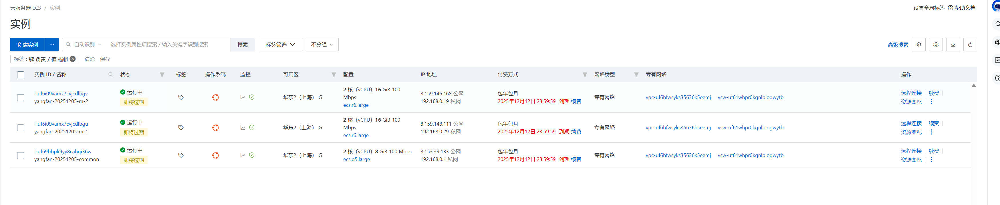
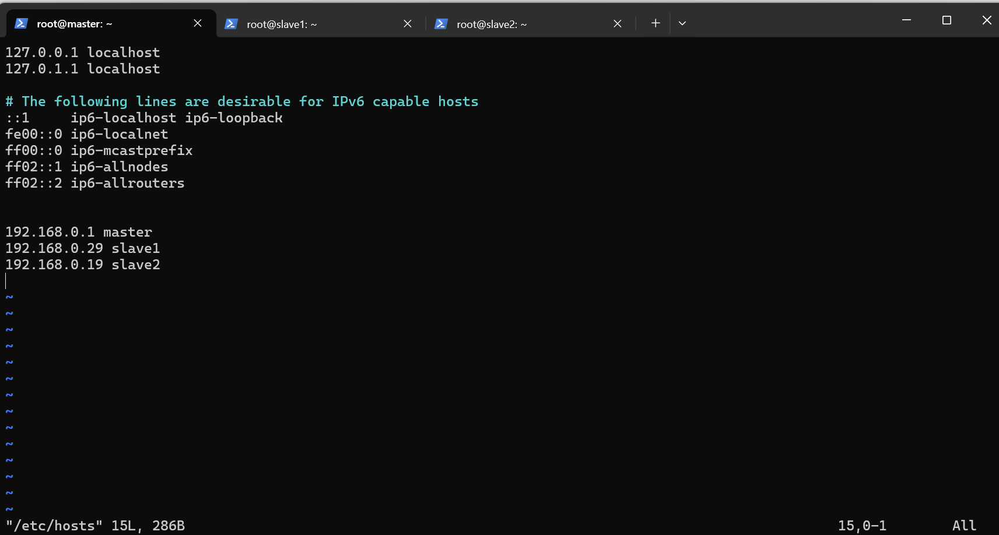

# 集群信息

集群由三个节点构成，一个 master 节点和两个 work 节点。

master 节点为 ecs.g5.large 这台机器。  
work 节点为 ecs.r6.large 的两台机器。



## 环境配置

### 改名字

首先是给三台机器分别改名字，master 节点的名字叫做 `master`，  
两台 work 节点的名字分别叫做 `slave1` 和 `slave2`。


### 配置 hosts 文件



### 配置 SSH 免密登入

为了让 master 节点启动 slave 的时候不用每次输入密码，我们给 master 配置 SSH 免密连接。

``` shell
ssh-keygen -t rsa
```

``` shell
ssh-copy-id master
ssh-copy-id slave1
ssh-copy-id slave2
```

### 安装 JAVA

本次实验 JAVA 版本选择 JDK8(后因框架版本问题，升级到JDK11)，在三台机器上分别执行：

``` shell
apt-get update
apt-get install -y openjdk-8-jdk
```


### 安装 Hadoop 和 spark

为了防止重复修改配置文件，我们直接在 master 节点配置，然后将对应的命令发送到 slave1 和 slave2 节点上。

首先是下载 hadoop 和 spark 对应的安装包：


解压对应的文件之后显示：


安装过程中经历了很多问题，忘记截图了。。。。。

## Summary

本次实验的集群采用的是阿里云的机器，其中：

- master 节点采用阿里云的通用性机器，配置为 2 核 8G，40G 的系统盘。
- worker 节点采用的是阿里云的内存型机器，配置为 2 核 16G，40G 的系统盘 + 额外扩充 100G SSD。
- 网络带宽均为 100 Mbps。
- 镜像采用 Ubuntu 22.04。
- 语言方面采用 JAVA 11、Python 3.10。
- 框架部分采用 Apache Hadoop 3.3.6、Apache Spark 3.5.7、Apache SystemDS 3.3.0。
- Python 的部分依赖库（NumPy，Pandas，Matplotlib，PySpark）均采用最新版本。

实例代码在 `verify.py` 中，运行执行指令：

``` shell
spark-submit verify_all.py
```

可以看到结果。

可以通过 `http://8.153.39.133:8080/` 查看 spark 集群的情况，但具体负载请查看阿里云的监控模块。

